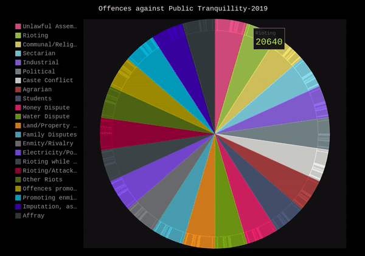
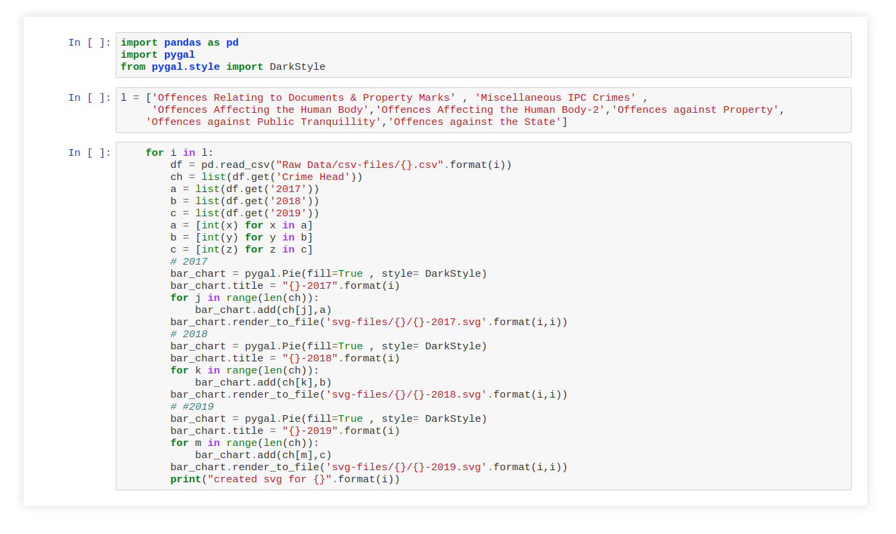
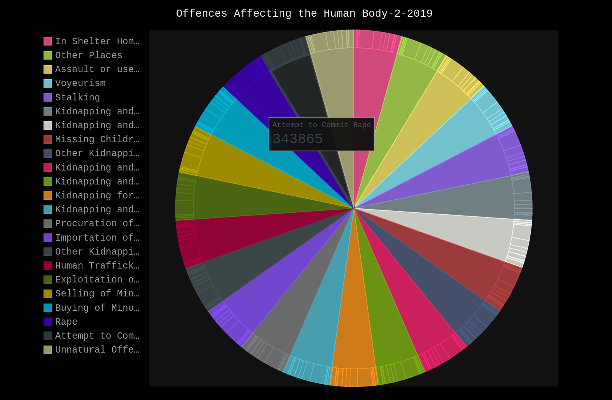
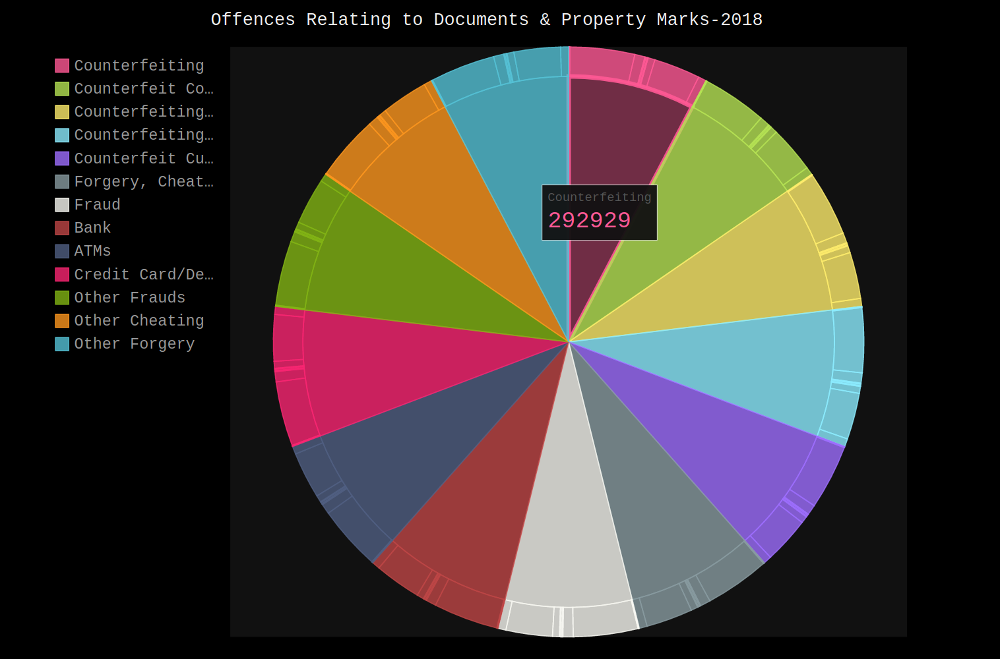
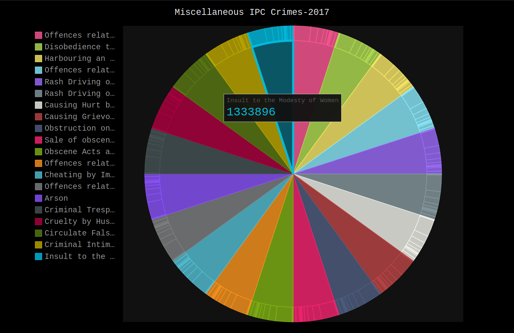
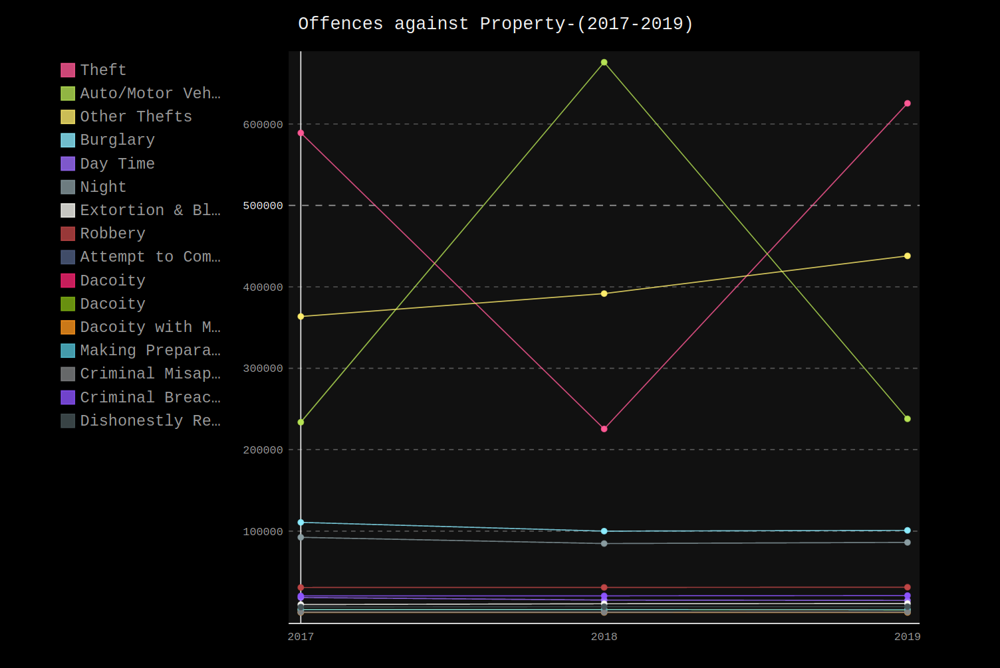

# Crime Visualization Project
## Based  on [Crime in India - Volume 1 (NCRB)](https://ncrb.gov.in/en/crime-india-2019-0#) 
### Exact PDF : [CII 2019 Volume1](https://ncrb.gov.in/sites/default/files/CII%202019%20Volume%201.pdf)
### You can check out the website at : [Crime Data Visualization Project](https://goldenryu2000.github.io/Crime-Visualization-Project/)

#### This Project Contains :
- Raw Data Files (Both .pdf and .csv files) [Data is extracted from PDF in the range of pages : 34-37]
- SVG-Files
- Web Assets for the [Website](https://goldenryu2000.github.io/Crime-Visualization-Project/)
- Python Scripts to generate Line Charts and Pie Charts of Data (.svg format). (Jupyter Notebook .ipynb files also included).



## How to run the SVG Script:
- Download/clone the git repository.
- Open terminal/Command Prompt at that directory.
- Write the following command to install the required pip libraries: 
```sh
$ pip install -r requirements.txt
```
### or
```sh
$ pip3 install -r requirements.txt
```
- Now you can run the two Python scripts to generate .svg files either as a program or using commands : 
```sh
$ python "Pie-Chart-SVG.py"
$ python "Line-Chart-SVG.py"
```
### Or
```sh
$ python3 "Pie-Chart-SVG.py"
$ python3 "Line-Chart-SVG.py"
```

# Some Screenshots: 








